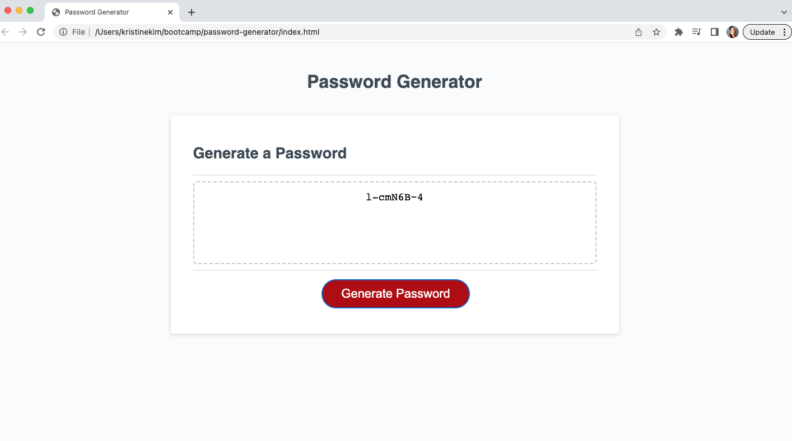

# Password Generator
> A password generator has been created for employees with access to sensitive data.  It will randomly generate a password that meets certain criteria so a strong password can be created in order to ensure greater security.
> Live demo [_here_](https://kristinehkim.github.io/password-generator/). <!-- If you have the project hosted somewhere, include the link here. -->

## Table of Contents
* [General Info](#general-information)
* [Features](#features)
* [Screenshots](#screenshots)
* [Usage](#usage)
* [Project Status](#project-status)
* [Room for Improvement](#room-for-improvement)
* [Acknowledgements](#acknowledgements)
* [Contact](#contact)
<!-- * [License](#license) -->

## General Information
The user will first choose the length of their password between 8 and 128 characters.  If the length is not within these limits, the user will be reminded to choose an appropriate length.  Then, the user will be presented with a series of prompts confirming whether or not they would like special characters, numbers, lowercase, and/or uppercase letters.  If none of these are chosen, the user will be reminded to choose at least one character.  Based on the characters the user chooses, one of each will be represented and a password will be generated.  This will create a secure password.
<!-- You don't have to answer all the questions - just the ones relevant to your project. -->

## Features
- The user can create a password using special characters, numbers, lowercase, and/or uppercase letters.
- A random password with one of each character selected will be generated for the user.

## Screenshots

<!-- If you have screenshots you'd like to share, include them here. -->

## Usage
The user must click on the red button that says "Generate Password" in order to be presented with a series of prompts.  The user will choose what characters to be included, and a random password will be generated based on the criteria chosen.

## Project Status
Project is: _in progress_. 

## Room for Improvement
Room for improvement:
- A way to check if one of each character the user chooses is represented.

## Acknowledgements
- Many thanks to my instuctor, Michael Pacheco, the TAs, Nirav Venkatesan and Julius Dorfman, and tutor, Dane Shrewsbury. 
- Met in a study group with Oswaldo and Kevin.

## Contact
Created by Kristine Kim.  Feel free to email me at kristinehkim@gmail.com. 

<!-- Optional -->
<!-- ## License -->
<!-- This project is open source and available under the [... License](). -->

<!-- You don't have to include all sections - just the one's relevant to your project -->